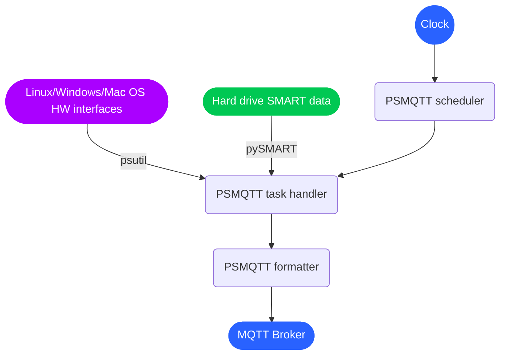

# PSMQTT Usage

<!-- vscode-markdown-toc -->
* [PSMQTT Architecture](#PSMQTTArchitecture)
* [Configuration file](#Configurationfile)
	* [CRON expression](#CRONexpression)
	* [Tasks](#Tasks)
		* [Category CPU](#category-cpu)
		* [Category Memory](#category-memory)
		* [Category Disks](#category-disks)
		* [Category Network](#category-network)
		* [Category Temperature](#category-temperature)
		* [Category Fan](#category-fan)
		* [Category Battery](#category-battery)
		* [Category Other system info](#category-other)
		* [Category Processes](#category-processes)
		* [Useful Tasks](#useful-tasks)
	* [Formatting](#formatting)
	* [MQTT Topic](#mqtt-topic)
	* [HomeAssistant Discovery Messages](#homeassistant-discovery-messages)
* [Sending MQTT requests](#sending-mqtt-requests)
* [Example configs](#example-configs)

<!-- vscode-markdown-toc-config
	numbering=false
	autoSave=true
	/vscode-markdown-toc-config -->
<!-- /vscode-markdown-toc -->


## <a name='PSMQTTArchitecture'></a>PSMQTT Architecture

The PSMQTT architecture can be described as:



The PSMQTT configuration file defines:
* periodicity of each PSMQTT action;
* which "sensor" has to be queried; PSMQTT uses [psutil](https://github.com/giampaolo/psutil) 
and [pySMART](https://github.com/truenas/py-SMART) libraries to sense data from the 
HW of the device where PSMQTT runs (CPU, memory, temperature and fan sensors, SMART harddrive data,
proces information, etc);
* how each sensor data is formatted into text;
* to which MQTT broker all the outputs will be published.

The following section provides more details about the config file syntax.

## <a name='Configurationfile'></a>Configuration file

The PSMQTT configuration file is a [YAML file](https://en.wikipedia.org/wiki/YAML).

The PSMQTT configuration file should be located in the same 
directory containing `psmqtt.py`; alternatevely you can specify the location of the
config file using the **PSMQTTCONFIG** environment variable 
(e.g. setting **PSMQTTCONFIG=~/my-config-psmqtt.yaml**).

Please check the comments in the [default psmqtt.yaml](../psmqtt.yaml) as
documentation for most of the entries.
Typically you will need to edit are those associated
with the MQTT broker:

```
mqtt:
  broker:
    host: <put here the IP address of your MQTT broker>
    port: <port where your MQTT broker listens, typically 1883>
```

The rest of this document will focus on the format of each "scheduling expression",
whose general format is:

```
schedule:
  - cron: <human-friendly CRON expression>
    tasks:
      - task: <task name>
        params: [ <param1>, <param2>, <param3>, ... ]
        formatter: <formatting rule>
        topic: <MQTT topic>
        ha_discovery:
          <HomeAssistant discovery options>
```

Each of the following section describes in details the YAML portions that define each "scheduling expression":

1. `<human-friendly CRON expression>`: [CRON expression](#cron-expression)
2. `<task name>` and `<param1>`, `<param2>`, `<param3>`, ...: [Tasks](#tasks)
3. `<formatting rule>`: [Formatting](#formatting)
4. `<MQTT topic>`: [MQTT Topic](#mqtt-topic)
5. `<HomeAssistant discovery options>`: [HomeAssistant Discovery Messages](#homeassistant-discovery-messages)


### <a name='CRONexpression'></a>CRON expression

The `<human-friendly CRON expression>` that appears in the [scheduling expression](#Configurationfile) 
is a string encoding a recurrent rule, 
like e.g. "every 5 minutes" or "every monday" or "every hour except 9pm, 10pm and 11pm".

You can check examples of recurring period definitions
[here](https://github.com/kvh/recurrent).

Note that cron expressions should be unique; if there are several schedules with the same period only
last one will be used.

### <a name='Tasks'></a>Tasks

PSMQTT supports a large number of "tasks".
A "task" is the combination of
* `<task-name>`: the specification of which sensor should be read; this is just a string;
* parameter list `<param1>`,  `<param2>`, ...,  `<paramN>`: these are either strings or integers 
  represented as a YAML list (the preferred syntax is to use a comma-separated list enclosed by 
  square brackets); such parameters act as additional selectors/filters for the sensor;

The meaning for `<param1>`, `<param2>` is task-dependent.
Also the number of required paraterms is task-dependent.

The result of each task are pushed to an MQTT topic.
As an example:

```
schedule:
  - cron: every 10sec
    tasks:
      - task: cpu_times_percent
        params: [ system ]
```

configures PSMQTT to publish on the MQTT topic **psmqtt/COMPUTER_NAME/cpu_times_percent/system**
the value of the `system` field returned by the psutil [cpu_times_percent](https://psutil.readthedocs.io/en/latest/#psutil.cpu_times_percent) function.

Most tasks support wildcard `*` parameters which will cause the task to produce **multiple outputs**; 
in such case the MQTT topic associated with the task should actually be 
an MQTT topic _prefix_ so that each task output will be published on a different topic.
As an example:

```
schedule:
  - cron: every 10sec
    tasks:
      - task: cpu_times_percent
        params: [ "*" ]
        topic: "cpu/*"
```

configures PSMQTT to publish on 10 MQTT topics:

* **psmqtt/COMPUTER_NAME/cpu/user** the value of the `user` field returned by the psutil [cpu_times_percent](https://psutil.readthedocs.io/en/latest/#psutil.cpu_times_percent) function.
* **psmqtt/COMPUTER_NAME/cpu/nice** the value of the `nice` field returned by the psutil [cpu_times_percent](https://psutil.readthedocs.io/en/latest/#psutil.cpu_times_percent) function.
* **psmqtt/COMPUTER_NAME/cpu/system** the value of the `system` field returned by the psutil [cpu_times_percent](https://psutil.readthedocs.io/en/latest/#psutil.cpu_times_percent) function.

... etc etc ...


Most tasks support also the wildcard `+` parameter to get all possible fields of the psutil or pySMART output in one single topic, encoding them as a **JSON string**; in other words a single MQTT message will be published
on a single MQTT topic with a message payload containing a JSON string.
As an example:

```
schedule:
  - cron: every 10sec
    tasks:
      - task: cpu_times_percent
        params: [ "+" ]
        topic: "cpu"
```

configures PSMQTT to publish on the MQTT topic **psmqtt/COMPUTER_NAME/cpu**
the JSON encoding of what is returned by the psutil [cpu_times_percent](https://psutil.readthedocs.io/en/latest/#psutil.cpu_times_percent) function, e.g. `{"user": 12.0, "nice": 1.0, "system": 5.0, ...}`.

In case of task execution error, the error message is sent to a topic named
**psmqtt/COMPUTER_NAME/error/TASK**. Please check [some MQTT documentation](https://www.hivemq.com/blog/mqtt-essentials-part-5-mqtt-topics-best-practices/) to understand the role of the `/` MQTT
topic level separator.

Here follows the reference documentation for all required tasks and their parameters:

#### <a name='CategoryCPU'></a>Category CPU

  * Task name: `cpu_percent`
    * Short description: CPU total usage in percentage. [ Full reference ]( https://psutil.readthedocs.io/en/latest/#psutil.cpu_percent )
    * **REQUIRED**: `<param1>`: The wildcard `*` or `+` to select all the CPUs or the CPU index `0`, `1`, `2`, etc to select a single CPU
  * Task name: `cpu_times`
    * Short description: CPU times information. [ Full reference ]( https://psutil.readthedocs.io/en/latest/#psutil.cpu_times )
    * **REQUIRED**: `<param1>`: The wildcard `*`  or `+` to select all fields or a field name like `user`, `nice`, `system`, etc.
  * Task name: `cpu_times_percent`
    * Short description: CPU times in percentage. [ Full reference ]( https://psutil.readthedocs.io/en/latest/#psutil.cpu_times_percent )
    * **REQUIRED**: `<param1>`: The wildcard `*` or `+` to select all fields or a field name like `user`, `nice`, `system`, etc.
      Check full reference for all available fields
    * **OPTIONAL**: `<param2>`: The wildcard `*` or `+` to select all CPUs or the CPU index `0`, `1`, `2`, etc to select a single CPU.
      Note that you cannot use a wildcard as `<param2>` together with a wildcard on `<param1>`.
  * Task name: `cpu_stats`
    * Short description: CPU statistics. [ Full reference ]( https://psutil.readthedocs.io/en/latest/#psutil.cpu_stats )
    * **REQUIRED**: `<param1>`: The wildcard `*`  or `+` to select all fields or or a field name like `ctx_switches`, `interrupts`, `soft_interrupts`, `syscalls`.

#### <a name='CategoryMemory'></a>Category Memory

  * Task name: `virtual_memory`
    * Short description: Virtual memory information. [ Full reference ]( https://psutil.readthedocs.io/en/latest/#psutil.virtual_memory )
    * **REQUIRED**: `<param1>`: The wildcard `*`  or `+` to select all fields or one of  `total`, `available`, `percent`, etc.
      Check full reference for all available fields
  * Task name: `swap_memory`
    * Short description: Swap memory information. [ Full reference ]( https://psutil.readthedocs.io/en/latest/#psutil.swap_memory )
    * **REQUIRED**: `<param1>`: The wildcard `*`  or `+` to select all fields or one of  `total`, `used`, `free`, etc.
      Check full reference for all available fields

#### <a name='CategoryDisks'></a>Category Disks

  * Task name: `disk_partitions`
    * Short description: List of mounted disk partitions. [ Full reference ]( https://psutil.readthedocs.io/en/latest/#psutil.disk_partitions )
    * **REQUIRED**: `<param1>`: The wildcard `*`  or `+` to select all fields or a field name like `device`, `mountpoint`, `fstype`, `opts`.
    * **OPTIONAL**: `<param2>`: The wildcard `*` or `+` to select all partitions or an index `0`, `1`, `2`, etc to select a specific partition.
      Note that you cannot use a wildcard as `<param2>` together with a wildcard on `<param1>`.
  * Task name: `disk_usage`
    * Short description: Disk usage for a particular drive. [ Full reference ]( https://psutil.readthedocs.io/en/latest/#psutil.disk_usage )
    * **REQUIRED**: `<param1>`: The wildcard `*`  or `+` to select all fields or a field name like `total`, `used`, `free`, `percent`.
    * **REQUIRED**: `<param2>`: The path where disk usage must be measured, e.g. `/`, `/var` or `/home/<username>`.
  * Task name: `disk_io_counters`
    * Short description: Disk I/O counters. [ Full reference ]( https://psutil.readthedocs.io/en/latest/#psutil.disk_io_counters )
    * **REQUIRED**: `<param1>`: The wildcard `*`  or `+` to select all fields or a field name like `read_count`, `write_count`, `read_bytes`, `write_bytes`, etc.
      Check full reference for all available fields
    * **REQUIRED**: `<param2>`: The wildcard `*` or `+` to select all partitions or an index `0`, `1`, `2`, etc to select a specific partition.
      Note that you cannot use a wildcard as `<param2>` together with a wildcard on `<param1>`.
  * Task name: `smart`
    * Short description: Self-Monitoring, Analysis and Reporting Technology System (SMART) counters built into most modern ATA/SATA, SCSI/SAS and NVMe disks. [ Full reference ]( https://www.smartmontools.org/wiki/TocDoc )
    * **REQUIRED**: `<param1>`: The name of a specific drive e.g. `/dev/md0` or `/dev/sda`.
    * **REQUIRED**: `<param2>`: The wildcard `*` or `+` to select all S.M.A.R.T. attributes or a field name like 
      `interface`, `is_ssd`, `model`, `name`, `path`, `rotation_rate`, `serial`, `smart_capable`, `smart_enabled`, `smart_status`, `temperature`, `test_capabilities`.
      All SMART attributes are reported in fields named `attribute_raw[ATTRIBUTE_NAME]`. The availability of specific
      attributes depends on the disk vendor and disk model. E.g. a typical SMART attribute name would be `Power_On_Hours`
      which can be selected using for `<param2>` the value `attribute_raw[Power_On_Hours]`.
      All SMART tests (short self tests, long self tests, etc) are reported in fields named `test[TEST_INDEX]`
      with `<TEST_INDEX>` being a number `0`, `1`, `2`, etc (depending on how many SMART tests were run on the disk).
      The value of each `test[TEST_INDEX]` is a JSON string containing details about that test, e.g. `hours`, `type`,
      `status`, etc. The tests are sorted by `hours` in decreasing order so that `test[0]` always indicates the most
      recent SMART test results.
      You can try the following Python snippet on your prompt to see which SMART attributes are detected by pySMART library for e.g. your device `/dev/sda`: `sudo python3 -c 'import pySMART; pySMART.Device("/dev/sda").all_attributes()'`

#### <a name='CategoryNetwork'></a>Category Network

  * Task name: `net_io_counters`
    * Short description: Network I/O counters. [ Full reference ]( https://psutil.readthedocs.io/en/latest/#psutil.net_io_counters )
    * **REQUIRED**: `<param1>`: The wildcard `*`  or `+` to select all fields or a field name like `bytes_sent`, `bytes_recv`, `packets_sent`, `packets_recv`, etc.
      Check full reference for all available fields
    * **OPTIONAL**: `<param2>`: The wildcard `*` or `+` to select all network interface cards (NICs) or a NIC name like e.g. `eth0`, `wlan0`, `enp3s0f0`, etc to select a specific NIC.
      Note that you cannot use a wildcard as `<param2>` together with a wildcard on `<param1>`.

#### <a name='CategoryTemperature'></a>Category Temperature

  * Task name: `sensors_temperatures`
    * Short description: Hardware temperatures. [ Full reference ]( https://psutil.readthedocs.io/en/latest/#psutil.sensors_temperatures )
    * **REQUIRED**: `<param1>`: The wildcard `*`  or `+` to select all available sensor types (e.g. `asus`, `coretemp`, `amdgpu`, etc).
      Try the following Python snippet on your prompt to see which temperature sensor types are detected by psutil library: `python3 -c 'import psutil, pprint; pprint.pprint(psutil.sensors_temperatures())'`
    * **OPTIONAL**: `<param2>`: The wildcard `*` or `+` to select all temperature sensors of the selected sensor type or a `label` value to select a specific sensor.
      E.g. you might want to use `Core 0` as label to publish only the temperature of the first logical core.
    * **OPTIONAL**: `<param3>`: The wildcard `*` or `+` to select all temperature information available from the selected sensors or field name like `current`, `high`, `critical` 
      to select only a specific information.

#### <a name='CategoryFan'></a>Category Fan

  * Task name: `sensors_fans`
    * Short description: Hardware fans speed. [ Full reference ]( https://psutil.readthedocs.io/en/latest/#psutil.sensors_fans )
    * **REQUIRED**: `<param1>`: The wildcard `*`  or `+` to select all available sensor types (e.g. `asus`, etc).
      Try the following Python snippet on your prompt to see which fan sensor types are detected by psutil library: `python3 -c 'import psutil, pprint; pprint.pprint(psutil.sensors_fans())'`
    * **OPTIONAL**: `<param2>`: The wildcard `*` or `+` to select all fan sensors of the selected sensor type or a `label` value to select a specific sensor.
      E.g. you might want to use `cpu_fan` as label to publish only the fan speed of the CPU.
    * **OPTIONAL**: `<param3>`: The wildcard `*` or `+` to select all information available from the selected sensors or field name like `current` 
      to select only a specific information.

#### <a name='CategoryBattery'></a>Category Battery

  * Task name: `sensors_battery`
    * Short description: Battery status information. [ Full reference ]( https://psutil.readthedocs.io/en/latest/#psutil.sensors_battery )
    * **REQUIRED**: `<param1>`: The wildcard `*`  or `+` to select all fields or a field name like `percent`, `secsleft`, `power_plugged`, etc.
      Check full reference for all available fields and their meaning.

#### <a name='CategoryOthersysteminfo'></a>Category Other system info

  * Task name: `users`
    * Short description: Users currently connected on the system. [ Full reference ]( https://psutil.readthedocs.io/en/latest/#psutil.users )
    * **REQUIRED**: `<param1>`: The wildcard `*`  or `+` to select all fields or a field name like `name`, `terminal`, `host`, `started`, etc.
      Check full reference for all available fields and their meaning.
    * **OPTIONAL**: `<param2>`: The wildcard `*` or `+` to select all users or an index `0`, `1`, `2`, etc to select a specific user.
  * Task name: `boot_time`
    * Short description: System boot time. [ Full reference ]( https://psutil.readthedocs.io/en/latest/#boot_time.users )
    * **NO PARAMETES**

#### <a name='CategoryProcesses'></a>Category Processes

  * Task name: `pids`
    * Short description: Currently running process IDs. [ Full reference ]( https://psutil.readthedocs.io/en/latest/#psutil.pids )
    * **REQUIRED**: `<param1>`: The wildcard `*`  or `+` to select all PIDs, the `count` string to return just the number of PIDs or an index `0`, `1`, `2`, etc to select a specific process ID.
  * Task name: `processes`
    * Short description: Single process parameters. [ Full reference ]( https://psutil.readthedocs.io/en/latest/#processes )
    * **REQUIRED**: `<param1>`: one of 
      - numeric ID of the process
      - `top_cpu` - top CPU consuming process
      - `top_cpu[N]` - CPU consuming process number N
      - `top_memory` - top memory consuming process
      - `top_memory[N]` - memory consuming process number N
      - `pid[PATH]` - process with ID specified in the file having PATH path (.pid file).
      - `name[PATTERN]` - process with name matching PATTERN pattern (use `*` to match zero or more characters, `?` for single character)
      - `*` - to get value of some property for all processes. Topic per process ID
      - `+` - to get value of some property for all processes in one topic (JSON string)
    * **OPTIONAL**: `<param2>`: one of
      - `pid` - process ID
      - `ppid - `parent process ID
      - `name` - process name
      - `exe` - process executable file
      - `cwd` - process working directory
      - `cmdline/*` - command line. Topic per line
      - `cmdline/+` - command line in one topic (JSON string)
      - `cmdline/count` - number of command line lines
      - `cmdline/{0/1/etc}` - command line single line
      - `status` - process status (running/sleeping/idle/dead/etc)
      - `username` - user started process
      - `create_time` - time when process was started (Unix timestamp)
      - `terminal` - terminal of the process
      - `uids/*` - process user IDs. Topic per parameter
      - `uids/+` - process user IDs in one topic (JSON string)
      - `uids/{real/effective/saved}` - process user IDs single parameter
      - `gids/*` - process group IDs. Topic per parameter
      - `gids/+` - process group IDs in one topic (JSON string)
      - `gids/{real/effective/saved}` - process group IDs single parameter
      - `cpu_times/*` - process CPU times. Topic per parameter
      - `cpu_times/+` - process CPU times in one topic (JSON string)
      - `cpu_times/{user/system/children_user/children_system}` - process CPU times single parameter
      - `cpu_percent` - CPU percent used by process
      - `memory_percent` - memory percent used by process
      - `memory_info/*` - memory used by process. Topic per parameter
      - `memory_info/+` - memory used by process in one topic (JSON string)
      - `memory_info/{rss/vms/shared/text/lib/data/dirty/uss/pss/swap}` - memory used by process single parameter
      - `io_counters/*` - process I/O counters. Topic per parameter
      - `io_counters/+` - process I/O counters in one topic (JSON string)
      - `io_counters/{read_count/write_count/read_bytes/write_bytes}` - process I/O single counter
      - `num_threads` - number of threads
      - `num_fds` - number of file descriptors
      - `num_ctx_switches/*` - number of context switches. Topic per parameter
      - `num_ctx_switches/+` - number of context switches in one topic (JSON string)
      - `num_ctx_switches/{voluntary/involuntary}` - context switches single counter
      - `nice` - nice value
      - `*` - all process properties. Topic per property
      - `+` - all process properties in one topic (JSON string)
      - `**` - all process properties and sub-properties. Topic per property
      - `**;` -  all process properties and sub-properties in one topic (JSON string)


#### <a name='UsefulTasks'></a>Useful Tasks

These are 'tasks' I found most relevant and useful for tracking my
server(s) health and performance:

Task|Description
----|------------
`boot_time`|Up time
`cpu_percent`|CPU total usage in percent
`sensors_temperatures/coretemp/0/`|CPU package temperature
`virtual_memory/percent`|Virtual memory used
`virtual_memory/free/{{x\|GB}}`|Virtual memory free, GB
`swap_memory/percent`|Swap memory used
`disk_usage/percent/\|`|Root drive (forward slash replaced with pipe) usage in percent (Linux)
`disk_usage/free/\|/{{x\|GB}}`|space left in GB for root drive (Linux)
`smart/nvme0/`|All SMART attributes for the device \'nvme0\' (requires root priviliges)
`smart/nvme0/temperature`|Just the device \'nvme0\' temperature (requires root priviliges)
`processes/top_cpu/name`|Name of top process consuming CPU
`processes/top_memory/exe`|Executable file of top process consuming memory
`sensors_fans/dell_smm/0`|Fan seed
`sensors_battery/percent`|Battery charge

### <a name='Formatting'></a>Formatting

The output of each task can be formatted using
[Jinja2](http://jinja.pocoo.org/) templates in the `formatter` field of [task definitions](#Configurationfile)

E.g.:   

```
schedule:
  - cron: every 10sec
    tasks:
      - task: cpu_times_percent
        params: [ "user" ]
        formatter: "{{x}}%"
```

configures PSMQTT to append the `%` symbol after CPU usage.

For task providing many outputs (using wildcard `*`) all outputs are
available by name if they are named.
Unnamed outputs are available as `x`.
When the task produces multiple unnamed outputs they are available as `x[1]`, `x[2]`, etc if they are
numbered. 

psmqtt provides some Jinja2 filters:

* `KB`,`MB`,`GB` to format value in bytes as KBytes, MBytes or GBytes.
* `uptime_str` to format Linux epochs (mostly the output of the `boot_time` task) as a human friendly uptime string representation (e.g., the output string might look like 
"30 days, 5:18").
* `uptime_sec` to format Linux epochs (mostly the output of the `boot_time` task) as a number of seconds elapsed since last boot.
* `iso8601_str`  to format Linux epochs (mostly the output of the `boot_time` task) as an [ISO8601](https://en.wikipedia.org/wiki/ISO_8601) timestamp; this is particularly useful to create HomeAssistant sensors with a `timestamp` device class.

Examples:

```
  - task: virtual_memory
    params: [ "*" ]
    # emit free virtual memory in %
    formatter: "{{(100*free/total)|int}}%"

  - task: virtual_memory
    params: [ "free" ]
    # emit free virtual memory in MB instead of bytes
    formatter: "{{x|MB}}"

  - task: cpu_times_percent
    params: [ "user", "*" ]
    # emit total CPU time spend in user mode for the first and second logical cores only
    formatter: "{{x[0]+x[1]}}"

  - task: boot_time
    formatter: "{{x|uptime_str}}"

```


### <a name='MQTTTopic'></a>MQTT Topic

The `<MQTT topic>` specification in each [task definition](#Configurationfile) is optional.
If it is not specified, psmqtt will generate automatically an output MQTT topic 
in the form **psmqtt/COMPUTER_NAME/<task-name>**.

To customize the prefix **psmqtt/COMPUTER_NAME** you can use the `mqtt.publish_topic_prefix`
key in the configuraton file. E.g.:

```
mqtt:
  publish_topic_prefix: my-prefix
```

configures psmqtt to emit all outputs at **my-prefix/<task-name>**.

It's important to note that when the task emits more than one output due to the use of the
wildcard `*` character then the MQTT topic _must_ be specified and _must_ include the 
wildcard `*` character itself.
As an example the task

```
schedule:
  - cron: every 10sec
    tasks:
      - task: cpu_times_percent
        params: [ "*" ]
        topic: "cpu/*"
```

is producing 10 outputs on a Linux system: one for each of the `user`, `nice`, `system`,
`idle`, `iowait`, `irq`, `softirq`, `steal`, `guest` and `guest_nice` fields emitted by psutil.
These 10 outputs must be published on 10 different MQTT topics.
The use of `cpu/*` as MQTT topic configures psmqtt to send the 10 outputs to the following 10 topics:
* **psmqtt/COMPUTER_NAME/cpu/user**
* **psmqtt/COMPUTER_NAME/cpu/nice**
* **psmqtt/COMPUTER_NAME/cpu/system**
* **psmqtt/COMPUTER_NAME/cpu/idle**
* **psmqtt/COMPUTER_NAME/cpu/iowait**
* **psmqtt/COMPUTER_NAME/cpu/irq**
* **psmqtt/COMPUTER_NAME/cpu/softirq**
* **psmqtt/COMPUTER_NAME/cpu/steal**
* **psmqtt/COMPUTER_NAME/cpu/guest**
* **psmqtt/COMPUTER_NAME/cpu/guest_nice**

If the wildcard `*` character is used in the task parameters but the MQTT topic is not specified
or does not contain the wildcard `*` character itself, then an error will be emitted (check psmqtt logs).


### <a name='HomeAssistantDiscoveryMessages'></a>HomeAssistant Discovery Messages

The `<HomeAssistant discovery options>` specification in each [task definition](#Configurationfile) is optional.
If it is specified, psmqtt will generate MQTT messages that follow the [Home Assistant MQTT discovery message specs](https://www.home-assistant.io/integrations/mqtt/#discovery-messages).

These messages are extremehely useful to quickly setup connect **PSMQTT** and **Home Assistant** (HA) together,
since HA will automatically detect the presence of PSMQTT "sensors".

If you want to configure MQTT discovery messages for HA, you should:

1. Ensure to enable the feature 

```
mqtt:
  ha_discovery:
    enabled: true
```

2. For each task specify as bare minimum the `ha_discovery.name` and `ha_discovery.platform` properties:

```
- task: cpu_times_percent
  params: [ "*" ]
  topic: "cpu/*"
  ha_discovery:
    name: "CPU Usage Percentage"
    platform: sensor
```

Consider that the `ha_discovery.name` will be the human-friendly name of the HA entity;
`ha_discovery.platform` can be either `sensor` or `binary_sensor`.
Most of psmqtt tasks produce `sensor`s but there are a few exceptions, e.g. the `power_plugged` field of
the `sensors_battery` task (which is either "true" or "false") or the `smart_status` field of the `smart` task
(which is either "PASS" or "FAIL").

Additional HA discovery messages that you might want to set to improve the look&feel of
the HA entities are:

```
  ha_discovery:
    name: <some friendly name>
    platform: sensor|binary_sensor
    device_class: temperature|duration|timestamp|problem|...
    icon: mdi:<whatever>
    unit_of_measurement: %|bytes|...
    expire_after: <an integer number of seconds>
    payload_on: <useful only for binary_sensor>
    payload_off: <useful only for binary_sensor>
    value_template: <tell HA how to render the number>
```

See [MQTT Binary sensors](https://www.home-assistant.io/integrations/binary_sensor.mqtt/) and
[MQTT sensors](https://www.home-assistant.io/integrations/sensor.mqtt/) docs by HomeAssistant for more details.

For the `icon` field, you can use online resources for [searching Material Design Icons](https://pictogrammers.com/library/mdi/).

Check also the [default psmqtt.yaml](../psmqtt.yaml) for some examples
or the psmqtt configuration examples later in this document.

Note that PSMQTT will publish MQTT discovery messages in 2 cases:

1. when an HomeAssistant restart is detected;
2. at PSMQTT startup

This policy optimizes network traffic (reducing it to the minimal) but ensures that HomeAssistant
is always instantly updated on any PSMQTT sensor that is enriched with the `ha_discovery` metadata.


## <a name='SendingMQTTrequests'></a>Sending MQTT requests

The [psmqtt.yaml](../psmqtt.yaml) file supports a configuration named "request_topic":

```
mqtt:
  request_topic: request
```

This configuration allows you to specify an MQTT topic that will be **subscribed** 
by psmqtt and used as **input** trigger for emitting measurements.
This is an alternative way to use psmqtt compared to the use of cron expressions.

E.g. to force psmqtt to run the task:
```
- task: cpu_times_percent
  params: [ "*" ]
  topic: "cpu/*"
```

it's possible to send the YAML string above on the topic **psmqtt/COMPUTER_NAME/request**;
the task will be executed immediately when received and will be interpreted like any
other task in the configuration file.


## <a name='Exampleconfigs'></a>Example configs

The following `psmqtt.yaml` is an example intended to be used as reference for some
syntax rules explained in this document:

```
logging:
  level: WARNING
  report_status_period_sec: 10

mqtt:
  broker:
    host: 192.168.0.3
    port: 1883
    username: psmqtt
    password: psmqtt-s3cr3t-pass
  clientid: psmqtt
  
schedule:
  - cron: "every 1 minute"
    tasks:
      - task: cpu_percent
        params: [ total ]
        ha_discovery:
          name: "CPU Percentage"
          platform: sensor
          unit_of_measurement: "%"
          icon: mdi:speedometer
      - task: virtual_memory
        params: [ percent ]
        ha_discovery:
          name: "Memory Percentage"
          platform: sensor
          unit_of_measurement: "%"
          icon: mdi:memory

      # cpu temp
      - task: sensors_temperatures
        params: [ rtk_thermal, 0 ]
        ha_discovery:
          name: "CPU Temperature"
          platform: sensor
          device_class: temperature
          unit_of_measurement: "°C"
          icon: mdi:thermometer

      # temperatures for 2 HDD in RAID from S.M.A.R.T data
      - task: smart
        params: [ "/dev/sdc", temperature ]
        ha_discovery:
          name: "HDD1 Temperature"
          platform: sensor
          device_class: temperature
          unit_of_measurement: "°C"
          icon: mdi:thermometer
      - task: smart
        params: [ "/dev/sdd", temperature ]
        ha_discovery:
          name: "HDD2 Temperature"
          platform: sensor
          device_class: temperature
          unit_of_measurement: "°C"
          icon: mdi:thermometer
      
  - cron: "every 1 hour"
    tasks:
      - task: disk_usage
        params: [ percent, "/mnt/md0" ]
        ha_discovery:
          name: "RAID Array Disk Usage"
          platform: sensor
          unit_of_measurement: "%"
          icon: mdi:harddisk
    
  - cron: "every 3 hours"
    tasks:
      - task: boot_time
        formatter: "{{x|iso8601_str}}"
        ha_discovery:
          name: "Uptime"
          platform: sensor
          device_class: timestamp
          icon: mdi:calendar
          value_template: "{{ as_datetime(value) }}"
```

